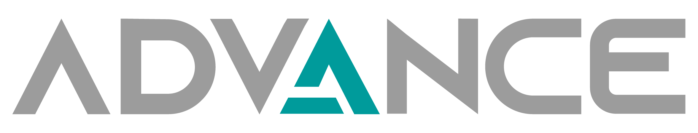

<p align="center">
  
</p>

<h1 align="center">Advance Desktop App</h1>

> Aplicación de escritorio avanzada para la gestión de doctores, pacientes y análisis médico con módulos de Inteligencia Artificial para detección de pólipos mediante CNN y Transformers.

---

## 🧠 Descripción

**Advance Desktop App** es una plataforma moderna desarrollada con **Electron + React + Tailwind + Ant Design**, que permite administrar:

- 👨‍⚕️ Doctores
- 🧑‍🤝‍🧑 Pacientes
- 🗂️ Consultas y estudios clínicos
- 🧠 Módulos de IA para análisis de imágenes médicas, detección de pólipos (vía redes neuronales convolucionales y modelos Transformer)

Todo en una aplicación de escritorio eficiente, multiplataforma y con diseño profesional.

---

## ⚙️ Requisitos

- [Node.js](https://nodejs.org/) v18 o superior
- [Git](https://git-scm.com/)
- Sistema operativo: Windows / macOS / Linux

---

## 🚀 Instalación para desarrollo

```bash
# 1. Clonar el repositorio
git clone https://github.com/tu-usuario/advance-desktop-app.git
cd advance-desktop-app

# 2. Instalar dependencias
npm install

# 3. Ejecutar en modo desarrollo
npm run start
```

---

## 📦 Construcción de la aplicación

Para generar el ejecutable:

```bash
npm run make
```

Esto generará el instalador en la carpeta `/out` listo para distribuir.

---

## 📁 Estructura del proyecto

```
.
├── assets/               # Iconos, logo e imágenes
├── src/
│   ├── components/       # Componentes reutilizables (Layout, UI, etc.)
│   ├── pages/            # Vistas (Doctores, Pacientes, etc.)
│   ├── routes/           # Rutas con React Router
│   ├── App.jsx           # Componente principal
│   ├── main.js           # Proceso principal de Electron
│   └── preload.js        # Comunicación segura entre Electron y Renderer
├── forge.config.js       # Configuración de Electron Forge
├── tailwind.config.js    # Configuración Tailwind
└── README.md             # Este archivo
```

---

## 🧠 Tecnologías clave

- ⚛️ React + Vite
- 💻 Electron Forge
- 🎨 TailwindCSS + Ant Design
- 🔁 React Router DOM
- 🧠 IA con TensorFlow.js / ONNX (integración futura)
- 🧱 Arquitectura modular y escalable

---

## 📸 Capturas (próximamente)

---

## 🧪 Estado del proyecto

🚧 En desarrollo – Primera versión funcional con módulos base de gestión.  
🧠 Integración de AI en progreso (detección de pólipos en imágenes médicas).

---

## 📝 Licencia

ScaleFlow © 2025

---

## 📬 Contacto

Para soporte o colaboraciones, contactanos en [ScaleFlow](https://scaleflow.tech/)